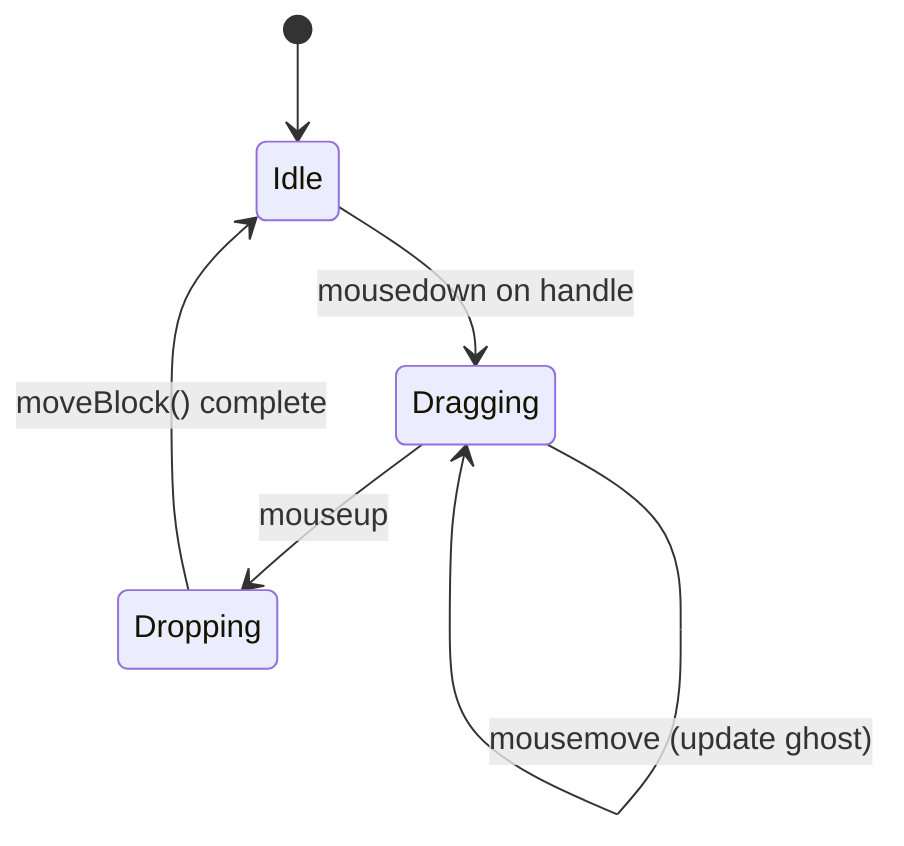

# 功能设计文档规范 (Functional Design Document Spec)

> 版本：v0.1 | 适用范围：comind 项目所有功能设计文档  
> 目的：定义"如何写功能设计文档"的标准，确保文档一致性、可读性和可维护性

---

## 1. 为什么需要这份规范

功能设计文档（FDD）是**开发前的技术契约**，核心价值：
- **对齐认知**：让开发者、评审者、未来维护者对功能理解一致
- **约束范围**：明确"做什么"和"不做什么"，防止需求蔓延
- **降低风险**：提前暴露技术难点、边界条件、性能瓶颈
- **加速评审**：结构化内容让评审者快速定位关键决策

**坏文档特征**：只有想法没有细节、只有 UI 没有数据模型、只有 happy path 没有边界处理。

---

## 2. 文档结构模板

每个功能设计文档**必须**包含以下 13 个章节（顺序固定）：

```markdown
# [功能名称] 功能设计

> 版本：v0.x | 作者：@xxx | 日期：YYYY-MM-DD | 状态：草案/评审中/已通过/已实现

## 1. 背景与动机 (Why)
## 2. 目标与范围 (What)
## 3. 术语表 (Glossary)
## 4. 用户故事与用例 (User Stories)
## 5. 设计与实现 (Design)
## 6. 数据模型 (Data Model)
## 7. 交互流程 (User Flow)
## 8. 边界条件与异常处理 (Edge Cases)
## 9. 性能与约束 (Performance)
## 10. 测试策略 (Testing)
## 11. 验收标准 (Acceptance Criteria)
## 12. 开放问题与风险 (Open Issues)
## 13. 附录 (Appendix)
```

---

## 3. 各章节写作指南

### 3.1 背景与动机 (Why)

**目的**：解释"为什么做这个功能"和"解决什么问题"。

**必须包含**：
- 当前痛点或业务需求（用具体场景说明）
- 如果不做这个功能会怎样
- 与项目愿景/roadmap 的关联

**示例**：
```markdown
## 1. 背景与动机

### 当前问题
用户反馈：在 Logseq 中，当 Block 数量超过 500 时，拖拽排序有明显卡顿（>300ms）。
我们的 MVP 目标是在 1000+ Block 时仍保持 <100ms 的响应速度。

### 为什么现在做
Phase 1 MVP 即将进入编辑器开发，拖拽是核心交互之一，
必须在实现前确定技术方案，避免后期重构。
```

**禁止**：
- ❌ "为了提升用户体验"（太抽象）
- ❌ 只写结论不写原因

---

### 3.2 目标与范围 (What)

**目的**：明确功能的边界，防止需求蔓延。

**必须包含**：
- **功能性目标**（做什么）：用 bullet points 列出
- **非功能性目标**（做到什么程度）：性能、可用性等
- **明确不做的事**（Out of Scope）：与功能性目标一一对应

**模板**：
```markdown
## 2. 目标与范围

### 功能性目标
- 支持 Block 之间的拖拽排序
- 支持跨层级拖拽（父子关系调整）
- 拖拽时显示插入位置指示线

### 非功能性目标
- 1000 个 Block 时拖拽响应 <100ms
- 支持撤销/重做（与现有 useUndo 集成）

### 明确不做的事（Out of Scope）
- 不支持跨 Page 拖拽（Phase 1）
- 不支持多点触控拖拽（桌面端优先）
- 不实现树状拖拽（保持大纲结构，不做文件树）
```

---

### 3.3 术语表 (Glossary)

**目的**：统一术语，避免"Block/节点/条目"混用。

**规则**：
- 只定义本功能特有的术语
- 通用术语（如"组件"、"状态管理"）不需定义
- 引用项目级术语时标注来源

**示例**：
```markdown
## 3. 术语表

| 术语 | 定义 | 来源 |
|------|------|------|
| Block | 编辑器中的最小内容单元，对应数据模型中的 Block 实体 | [data-model.md](./data-model.md) |
| Gap | Block 之间的插入位置，用于拖拽定位 | [data-model.md](./data-model.md) |
| Ghost Block | 拖拽时显示的半透明占位块 | 本功能定义 |
```

---

### 3.4 用户故事与用例 (User Stories)

**目的**：从用户视角描述功能行为。

**格式**：遵循 `As a [角色], I want [操作], so that [价值]`。

**必须包含**：
- 核心用户故事（happy path）
- 异常处理场景
- 优先级标注（P0/P1/P2）

**示例**：
```markdown
## 4. 用户故事与用例

### P0 - 核心功能
- **US-1**：作为用户，我想拖拽 Block 到新位置，以便重新组织内容
- **US-2**：作为用户，我想看到拖拽时的插入位置指示，以便准确放置

### P1 - 增强体验
- **US-3**：作为用户，我想拖拽后自动保存，以免丢失工作
- **US-4**：作为用户，我想用键盘触发拖拽（Accessibility），以便不用鼠标

### P2 - 未来优化
- **US-5**：作为用户，我想拖拽时看到目标 Block 的预览，以便确认位置
```

---

### 3.5 设计与实现 (Design)

**目的**：描述技术方案和关键实现细节。

**必须包含**：
- 技术选型（为什么用 A 不用 B）
- 架构图/流程图（用 Mermaid 或文字描述）
- 关键代码接口（TypeScript 类型定义、函数签名）
- 依赖关系（引用哪些现有模块）

**示例**：
```markdown
## 5. 设计与实现

### 5.1 技术选型
采用 Sortable.js 而非原生 HTML5 Drag & Drop：
- ✅ 成熟稳定（GitHub 28k stars），自动处理移动端兼容
- ✅ 内置动画和占位符，减少自定义代码
- ❌ 增加 bundle 体积 ~15KB (gzip)

对比原生 DnD：
- ❌ 需要处理 dragover/drop 事件细节，易出 bug
- ❌ 跨浏览器行为不一致

### 5.2 核心接口

```typescript
// 拖拽状态机
type DragState = 
  | { status: 'idle' }
  | { status: 'dragging'; blockId: string; ghostY: number }
  | { status: 'dropping'; targetGap: Gap }

// 拖拽事件
interface DragEvent {
  type: 'dragstart' | 'dragover' | 'drop'
  sourceBlockId: string
  targetGap: Gap
}
```

### 5.3 与现有模块的交互
- 调用 `useBlocks` Store 的 `moveBlock(sourceId, targetGap)` 方法
- 调用 `useHistory` 的 `pushState()` 以支持撤销
- 不直接操作 DOM，所有状态变更通过 Pinia Store
```

---

### 3.6 数据模型 (Data Model)

**目的**：定义功能涉及的数据结构变化。

**规则**：
- 如果功能不涉及数据模型变更，写"无变更"并说明原因
- 如果新增/修改字段，必须给出 TypeScript 类型定义
- 必须说明与现有模型的兼容性

**示例**：
```markdown
## 6. 数据模型

### 6.1 无变更说明
本功能仅涉及 UI 交互，不改变 Block/Page 的数据结构。
拖拽操作最终调用 `moveBlock()`，该方法已在 [store-patterns.md](./store-patterns.md) 中定义。

### 6.2 如果涉及变更（示例）
```typescript
// 在 Block 模型中添加拖拽相关临时字段（不持久化）
interface BlockUIData {
  isDragging: boolean      // 当前是否正在拖拽
  dragHandleVisible: boolean // 拖拽手柄是否显示
}
```
```

---

### 3.7 交互流程 (User Flow)

**目的**：描述用户操作流程和状态变化。

**推荐格式**：
- 用步骤列表描述流程
- 关键节点用 Mermaid 流程图
- 标注每个步骤的响应时间要求

**示例**：
```markdown
## 7. 交互流程

### 7.1 拖拽排序流程

1. 用户鼠标按下拖拽手柄（≥200ms 才触发，避免误触）
2. 进入 dragging 状态：
   - 原 Block 半透明（opacity: 0.5）
   - 显示 Ghost Block（虚线框）
3. 鼠标移动时：
   - 计算最近的 Gap（调用 `calcInsertPos()`）
   - 更新指示线位置（<16ms，保证 60fps）
4. 释放鼠标：
   - 调用 `moveBlock()` 更新数据
   - 触发自动保存（debounced 1s）
   - 退出 dragging 状态


```

---

### 3.8 边界条件与异常处理 (Edge Cases)

**目的**：提前识别风险点，避免"我以为不会发生"。

**必须包含**：
- 空状态处理（没有 Block 时拖拽会怎样）
- 并发/竞态条件（快速连续拖拽）
- 数据异常（Block 不存在、Gap 无效）
- 用户误操作（拖拽到自身、拖拽到非法位置）

**示例**：
```markdown
## 8. 边界条件与异常处理

| 场景 | 预期行为 | 实现方式 |
|------|---------|----------|
| 拖拽到自身 | 无操作，忽略 | `if (sourceId === targetBlockId) return` |
| 快速连续拖拽 | 队列化或取最后一次 | 用 `throttle()` 限制 100ms 内只处理一次 |
| 拖拽时 Block 被删除 | 取消拖拽，回到 Idle | 监听 Block 列表变化，检测 sourceBlock 是否存在 |
| 窗口失焦（Alt+Tab） | 取消拖拽 | 监听 `window.onblur` 事件 |
```

---

### 3.9 性能与约束 (Performance)

**目的**：量化性能要求，提供优化策略。

**必须包含**：
- 关键操作的响应时间要求（用具体数字）
- 数据量上限（如"支持 1000 个 Block"）
- 优化策略（懒加载、虚拟滚动、debounce 等）

**示例**：
```markdown
## 9. 性能与约束

### 9.1 性能指标
- 拖拽响应：<100ms（从 mousemove 到指示线更新）
- 动画帧率：≥60fps
- 内存占用：拖拽状态下增加 <5MB

### 9.2 数据量约束
- 测试覆盖：100 / 500 / 1000 / 5000 个 Block
- 超过 5000 个 Block：显示警告，建议拆分 Page

### 9.3 优化策略
- 用 `requestAnimationFrame` 而非 `setTimeout` 更新指示线
- Ghost Block 使用 `transform: translate3d()` 触发 GPU 加速
- 拖拽过程中暂停自动保存（避免阻塞主线程）
```

---

### 3.10 测试策略 (Testing)

**目的**：定义如何验证功能正确性。

**必须包含**：
- 单元测试范围（Store 方法、工具函数）
- 组件测试范围（拖拽交互、状态渲染）
- E2E 测试场景（完整用户流程）
- 性能测试（用具体数字和工具）

**示例**：
```markdown
## 10. 测试策略

### 10.1 单元测试
- `calcInsertPos()`：测试各种 Gap 计算场景（边界、空列表、无效位置）
- `moveBlock()`：测试跨层级移动、父子关系更新

### 10.2 组件测试（Vitest + @vue/test-utils）
- DragHandle 组件：测试 mousedown 事件触发
- BlockList 组件：测试拖拽状态渲染（ghost、指示线）

### 10.3 E2E 测试（Playwright）
- 场景 1：拖拽 Block 到新位置，验证顺序更新
- 场景 2：拖拽后刷新页面，验证持久化
- 场景 3：拖拽时按 Esc 取消，验证恢复原状

### 10.4 性能测试
- 用 `performance.now()` 测量拖拽响应时间
- 用 Playwright 模拟 1000 个 Block，验证 <100ms 响应
```

---

### 3.11 验收标准 (Acceptance Criteria)

**目的**：定义"做完了吗"的明确判断标准。

**规则**：
- 必须可测试（能写自动化测试或手动验证步骤）
- 必须具体（避免"用户体验良好"这种主观描述）
- 与用户故事对应

**示例**：
```markdown
## 11. 验收标准

### P0 - 必须满足
- [ ] 拖拽 Block 后，新顺序在 UI 上立即反映（无需刷新）
- [ ] 拖拽后 1 秒内自动保存（LocalStorage 有更新）
- [ ] 1000 个 Block 时拖拽响应 <100ms（用 performance.now() 验证）
- [ ] 支持撤销（Ctrl+Z 可恢复拖拽前的顺序）

### P1 - 应该满足
- [ ] 拖拽时显示插入位置指示线（视觉清晰）
- [ ] 拖拽手柄在 hover 时显示（非阻塞式）

### P2 - 可以不满足
- [ ] 拖拽时有平滑动画（CSS transition）
```

---

### 3.12 开放问题与风险 (Open Issues)

**目的**：记录未决问题和潜在风险，避免遗忘。

**格式**：
```markdown
## 12. 开放问题与风险

### 开放问题
- [ ] **Q1**：拖拽时是否应该展开折叠的 Block？（待 UX 确认）
- [ ] **Q2**：是否支持拖拽 Block 到 Page 标题上创建子 Page？（Phase 2 需求）

### 风险
- ⚠️ **R1**：Sortable.js 与 tiptap 编辑器可能存在事件冲突（需原型验证）
  - 缓解措施：先做 PoC，验证共存可行性
- ⚠️ **R2**：大量 Block 时 calcInsertPos() 可能成为性能瓶颈
  - 缓解措施：用二分查找优化位置计算（已计划）
```

---

### 3.13 附录 (Appendix)

**可选内容**：
- 参考资料（RFC、其他项目实现）
- 变更记录（版本对比）
- 相关文档链接

---

## 4. 文档格式规范

### 4.1 文件命名

```
<功能名>-design.md

# 示例
drag-drop-design.md
slash-command-design.md
backlinks-panel-design.md
```

**规则**：
- 小写字母 + 连字符（kebab-case）
- 放在 `docs/` 目录下
- 版本号体现在文档开头的元数据，不在文件名中

### 4.2 Markdown 格式

**标题层级**：
- `#` 一级：文档标题（仅一个）
- `##` 二级：主要章节（1-13，见 §3）
- `###` 三级：子章节
- `####` 四级：详细要点（尽量避免，用列表代替）

**代码块**：
- 用三个反引号 + 语言标识（` ```typescript `, ` ```bash `）
- 避免超长代码块（>50 行），提取到单独文件

**表格**：
- 用于结构化数据（术语表、边界条件、验收标准）
- 避免用于长文本（改用列表）

**链接**：
- 内部文档用相对路径：`./data-model.md`
- 外部链接用完整的 URL

### 4.3 元数据头

每个文档开头必须包含：

```markdown
# [功能名称] 功能设计

> 版本：v0.1 | 作者：@username | 日期：2026-04-29 | 状态：草案
```

**状态值**：
- `草案`：初稿，待完善
- `评审中`：已提交评审
- `已通过`：评审通过，可开发
- `已实现`：开发完成
- `已废弃`：不再使用

---

## 5. 评审流程

### 5.1 提交前自查

作者必须确认：
- [ ] 所有章节已填写（无"待补充"留白）
- [ ] 用户故事覆盖了核心场景和边界条件
- [ ] 数据模型与现有模型兼容
- [ ] 验收标准可测试
- [ ] 性能指标量化（有具体数字）

### 5.2 评审关注点

评审者重点检查：
- **一致性**：术语、命名、风格是否与项目其他文档一致
- **完整性**：是否遗漏关键场景（边界条件、异常处理）
- **可行性**：技术方案是否可实现，依赖是否可用
- **性能**：是否有潜在的性能瓶颈
- **可测试性**：验收标准是否可验证

### 5.3 评审通过标准

- P0 问题：0 个未解决
- P1 问题：≤3 个（且作者已计划修复）
- P2 问题：不限（可后续优化）

---

## 6. 版本管理

### 6.1 版本号规则

遵循语义化版本（Semantic Versioning）：

- **v0.1**：初稿，可能大幅修改
- **v0.x**：评审中，内容相对稳定
- **v1.0**：已通过评审，可作为开发依据
- **v1.x**：实现后，修复 bug 或补充细节

### 6.2 变更记录

在文档末尾添加：

```markdown
## 变更记录

| 版本 | 日期 | 变更内容 | 作者 |
|------|------|---------|------|
| v0.1 | 2026-04-29 | 初稿完成 | @jayyu |
| v0.2 | 2026-05-02 | 增加性能测试方案 | @jayyu |
| v1.0 | 2026-05-10 | 评审通过 | @reviewer |
```

---

## 7. 反例：坏文档的特征

以下是一些**应该避免**的写法：

### ❌ 反例 1：只有想法没有细节

```markdown
## 拖拽功能设计

我们要做一个很酷的拖拽功能，用户体验要好，性能要快。
```

**问题**：没有具体方案、没有量化指标、无法指导开发。

### ❌ 反例 2：只写 happy path

```markdown
## 用户故事
- 用户可以拖拽 Block
```

**问题**：没有考虑边界条件（拖拽到自身、快速连续拖拽、数据异常）。

### ❌ 反例 3：技术方案没理由

```markdown
## 技术选型
用 Sortable.js。
```

**问题**：为什么用 A 不用 B？有什么取舍？

### ❌ 反例 4：验收标准主观

```markdown
## 验收标准
- [ ] 用户体验良好
- [ ] 性能足够快
```

**问题**：什么叫"良好"？什么叫"足够快"？无法测试。

---

## 8. 快速检查清单

写完文档后，用这个清单快速自查：

```markdown
# 功能设计文档自查清单

## 结构完整性
- [ ] 所有 13 个章节已填写
- [ ] 术语表定义了功能特有术语
- [ ] 用户故事按 P0/P1/P2 分级

## 技术可行性
- [ ] 技术选型有对比（为什么用 A 不用 B）
- [ ] 关键接口有 TypeScript 类型定义
- [ ] 依赖的现有模块已明确列出

## 测试与验收
- [ ] 验收标准可测试（有具体判断方法）
- [ ] 测试策略覆盖了单元/组件/E2E
- [ ] 性能指标量化（有具体数字）

## 边界与风险
- [ ] 边界条件表格已填写（≥5 个场景）
- [ ] 开放问题已记录（即使是未决问题）
- [ ] 潜在风险有缓解措施

## 格式规范
- [ ] 文件名符合 kebab-case 规范
- [ ] 元数据头完整（版本/作者/日期/状态）
- [ ] 代码块有语言标识
- [ ] 内部链接使用相对路径
```

---

## 9. 总结

这份规范的核心原则：

1. **结构化**：固定章节顺序，降低认知负担
2. **量化**：用具体数字代替形容词（<100ms 而非"快"）
3. **边界优先**：先想异常，再做实现
4. **可测试**：每个功能都能写出测试用例
5. **可追溯**：版本号 + 变更记录 + 评审状态

> **记住**：好的设计文档不是"写完了"，而是"可以据此开发，且开发过程中不需要再问作者"。
