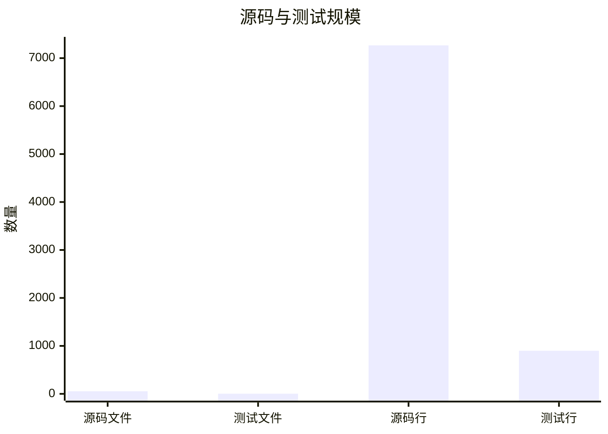
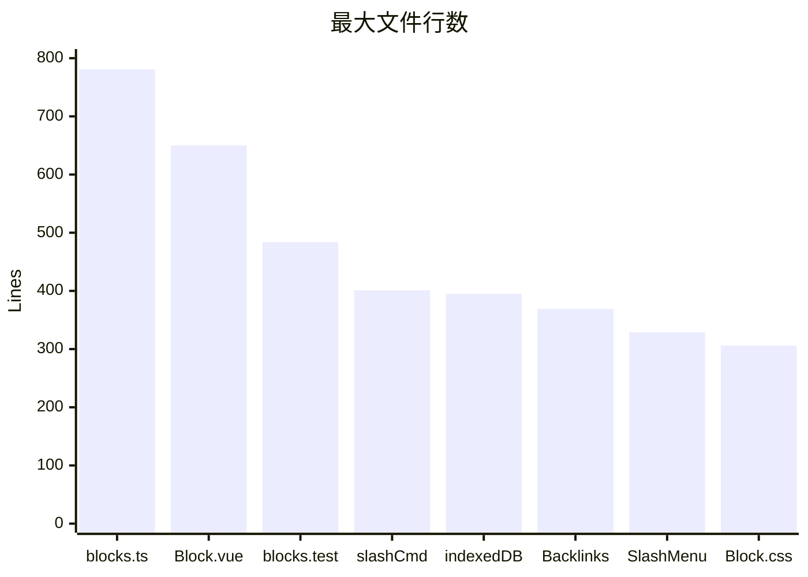
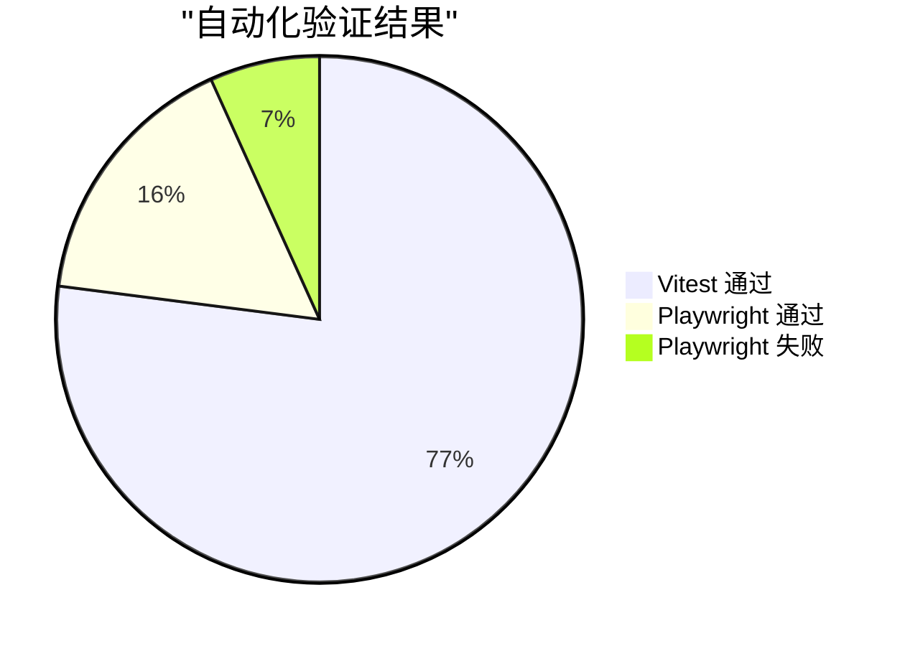
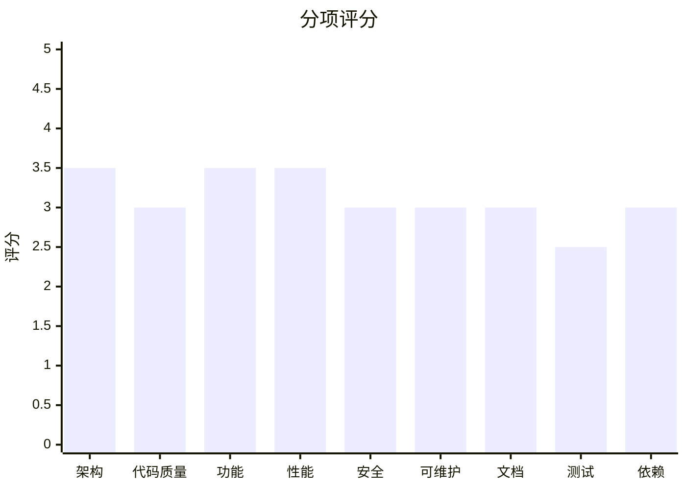

# comind 项目系统评估报告

评估日期：2026-05-11  
评估范围：`D:\comind` 根项目与 `D:\comind\comind` 前端应用  
评估方式：静态代码审查、依赖审计、构建/测试执行、E2E 执行、本地性能采样、文档与目录盘点。

## 1. 总体结论

项目是一个基于 Vue 3 + TypeScript + Vite + Pinia + IndexedDB/Dexie + TipTap 的本地知识管理/块编辑器应用。核心领域模型（Page、Block、Link）、块树构建、拖拽排序、Journal 路由、WikiLink、标签、收藏和反向链接等模块已经具备雏形，并且存在较多设计文档。

当前主要风险不是“无法构建”，而是“核心交互可用性与质量门禁不足”：单元测试通过、生产构建通过，但 E2E 路由测试 5/17 失败；代码集中度较高，最大文件 `src/stores/blocks.ts` 达 781 行，`src/components/Block/index.vue` 达 650 行；安全审计发现 1 个高危传递依赖漏洞；覆盖率报告、Lint、CI 门禁缺失。

## 2. 关键量化指标

| 维度 | 数据 | 说明 |
| --- | ---: | --- |
| 源码文件 | 55 | `src` 下非测试 `.ts/.vue/.css` |
| 测试文件 | 3 | `src/**/*.test.ts` |
| 源码行数 | 7,267 | 不含测试 |
| 单元测试行数 | 899 | 约为源码行数 12.4% |
| Vitest 单元用例 | 57 | 57/57 通过 |
| Playwright 用例 | 17 | 12 通过，5 失败 |
| Markdown 文档 | 36 | 根 `docs` + 应用 `docs` |
| E2E/调试文件 | 78 | `e2e` 下含 61 个 Python 脚本、4 个 Playwright spec |
| `any` 出现次数 | 20 | 类型精度不足点 |
| `console.*` 出现次数 | 22 | 运行期日志散落在源码 |
| 构建模块数 | 460 | Vite production build |
| 最大 JS chunk | 423.65 kB / gzip 134.78 kB | `SlashCommandMenu-*.js` |
| npm audit | 1 high | `glob` 传递依赖 GHSA-5j98-mcp5-4vw2 |

### 规模分布

### 最大文件 Top 8

### 质量门禁状态

## 3. 验证结果

| 命令 | 结果 | 关键输出 |
| --- | --- | --- |
| `npm test` | 通过 | 3 test files，57 tests，34.85s |
| `npm run build` | 通过 | `vue-tsc -b && vite build` 成功，5.34s |
| `npx vitest run --coverage` | 失败 | 缺少 `@vitest/coverage-v8` |
| `npx playwright test` | 失败 | 17 tests：12 passed，5 failed |
| `npm audit --registry=https://registry.npmjs.org` | 失败码但有结果 | 1 high vulnerability |
| `npm outdated --registry=https://registry.npmjs.org` | 有过期项 | 10 个包有可升级版本 |

本地 production preview 性能采样（Chromium headless，`http://127.0.0.1:4173/`）：

| 指标 | 数值 |
| --- | ---: |
| 外层计时 `page.goto` 到 networkidle | 674 ms |
| Navigation duration | 58 ms |
| DOMContentLoaded | 56 ms |
| loadEventEnd | 58 ms |
| Resource count | 13 |
| Transfer size | 236,845 bytes |
| Encoded body size | 232,945 bytes |

本地 dev server 采样（未压缩开发资源）：

| 指标 | 数值 |
| --- | ---: |
| 外层计时 `page.goto` 到 networkidle | 722 ms |
| Navigation duration | 172 ms |
| Resource count | 79 |
| Transfer size | 2,995,996 bytes |

## 4. 架构评估

### 合理之处

- 技术栈选择与产品形态匹配：Vue 3 Composition API、Pinia、Dexie/IndexedDB、TipTap 都适合本地优先的块编辑器。
- 模块边界基本清晰：`stores` 管状态，`storage` 管持久化，`utils` 管解析/排序/ID，`components` 管 UI，`composables` 管复用交互。
- 数据模型围绕 Page、Block、Link 展开，能支撑块树、WikiLink、Backlinks、Journal 等核心功能。
- `src/composables/useBlockTree.ts` 将树构建和拖拽同步拆成独立逻辑，有单元测试保护。

### 主要问题

1. **P1：核心 Store 承担过多职责**  
   `src/stores/blocks.ts` 同时处理插入位置、树遍历、编辑行为、合并、缩进、拖拽移动、防抖保存、标签缓存失效、页面更新时间同步，文件 781 行。风险是后续修改任意编辑行为都可能影响拖拽、持久化或导航。

2. **P1：核心 Block 组件过重**  
   `src/components/Block/index.vue` 650 行，混合了展示、编辑器生命周期、折叠动画、DOM 高度测量、拖拽命中测试、放置指示器渲染、跨页面导航与标签过滤。它已经是交互中枢，局部 bug 难以隔离。

3. **P2：App 和 Page 重复布局容器**  
   `src/App.vue:9` 和 `src/components/Page/index.vue:104` 都定义 `.page-scroll-wrapper`，Playwright 的 strict mode 已实际报出 `.page-scroll-wrapper` 匹配到 2 个元素。这会造成滚动、布局、测试定位与样式职责混乱。

4. **P2：文档很多但入口文档失效**  
   根 `README.md` 为空，`comind/README.md` 仍是 Vite 模板内容；虽然 `docs` 很丰富，但新人无法从 README 找到架构、运行、测试、设计入口。

## 5. 功能完整性与正确性

### 已具备模块

- 块编辑、拆分、合并、缩进/反缩进、移动、删除。
- 块树构建与拖拽同步。
- Page 创建、重命名、合并、删除。
- Journal 路由与自动创建。
- WikiLink 解析、Backlinks、Tag 解析与过滤。
- 收藏、最近页面、侧边栏。
- IndexedDB 本地持久化。

### 已发现正确性问题

1. **P0：路由 E2E 回归失败**  
   `e2e/routing.test.ts` 中 5 个用例失败：TC-03、TC-04、TC-05、TC-06、TC-08。失败集中在点击 journal item 后 URL 未变为 `/journal/yyyy-mm-dd`，以及 `.page-scroll-wrapper` 重复。影响 Journal 页面导航、刷新恢复、浏览器历史、侧边栏入口。

2. **P1：外部 WikiLink 渲染/打开逻辑不正确**  
   `src/composables/useContentRenderer.ts:22` 的普通 WikiLink 正则先匹配 `[[https://...]]`，导致 `src/composables/useContentRenderer.ts:26` 的外链分支基本不可达。即使命中外链分支，`data-external` 没有写入 URL，而 `src/components/Block/index.vue:324` 用 `window.open(link.dataset.external, '_blank')`，会打开空地址。建议先匹配外链，并渲染 `data-external="${escapedUrl}"`。

3. **P2：测试中存在不稳定等待方式**  
   `e2e/routing.test.ts` 使用多处 `waitForTimeout`，并依赖现有 IndexedDB 状态。用例在并行 worker 下共享浏览器存储，容易造成顺序依赖和偶发失败。

4. **P2：`test-gap-exhausted.spec.ts` 位于项目根但不被 Vitest 配置包含**  
   `vitest.config.ts` 只包含 `src/**/*.test.ts`，根级 `test-gap-exhausted.spec.ts` 不会被 `npm test` 执行。该文件中的 gap exhausted 回归测试没有进入默认质量门禁。

## 6. 代码质量与规范

### 正向观察

- TypeScript 构建通过，说明当前显式类型错误已被控制。
- 大部分领域函数命名清晰，`block-helpers.ts`、`parser.ts` 等工具层有测试。
- 复杂排序/位置逻辑已有边界测试，尤其 `moveBlock` 和 gap exhausted 相关逻辑。

### 问题清单

| 优先级 | 问题 | 证据 | 风险 | 建议 |
| --- | --- | --- | --- | --- |
| P1 | 缺少 lint/format 脚本 | `package.json` 只有 dev/build/preview/test | 风格漂移、未使用代码和危险模式无法门禁 | 增加 ESLint + Vue/TS 规则，先只报警后门禁 |
| P1 | `any` 较多 | 静态扫描 20 次 | 拖拽事件、PageItem、命令扩展类型不清 | 优先给拖拽事件、PageItem props、Command view 建类型 |
| P2 | 运行期日志散落 | 静态扫描 22 次 `console.*` | 生产噪音，难以区分真实错误 | 抽轻量 logger 或按 dev 环境控制 |
| P2 | 文件过大 | 2 个文件超过 600 行 | 修改风险集中，审查成本高 | 先抽纯函数与 DOM/拖拽工具，不重写行为 |
| P3 | 模板遗留组件 | `src/components/HelloWorld.vue` 存在 | 模板残留影响项目清洁度 | 确认无引用后删除 |

## 7. 性能评估

### 当前表现

- 生产预览首屏本地采样较快：Navigation 58 ms，networkidle 外层计时 674 ms。
- 构建后最大 chunk 为 `SlashCommandMenu-*.js`，423.65 kB，gzip 134.78 kB；该 chunk 名称可能包含 TipTap/editor 相关依赖，需用 bundle analyzer 确认。
- 开发模式资源传输约 3 MB、79 个资源，符合 dev server 未压缩/模块化特征，不应作为生产体积判断。

### 性能风险

1. **P1：大文档/深层块树下存在 O(n) 查找堆叠**  
   `blocks.ts` 多处通过 `blocks.value.find/filter` 在交互路径中查找祖先、兄弟、子节点；`Block/index.vue` 高度计算也遍历 DOM 子树。1000+ blocks 时拖拽、折叠、合并可能出现抖动。

2. **P2：最大 chunk 未设置预算**  
   当前 build 无 bundle budget。随着 TipTap 扩展、命令菜单和编辑能力增长，首屏包可能继续膨胀。

3. **P2：页面统计词数计算不准确且潜在偏高**  
   `src/storage/indexedDB.ts:366` 对空字符串 `''.split(/\s+/)` 计为 1，空块会增加 wordCount。

## 8. 安全性评估

### 依赖漏洞

`npm audit --registry=https://registry.npmjs.org` 发现 1 个 high：

- `glob`：GHSA-5j98-mcp5-4vw2，CWE-78，CVSS 7.5，范围 `>=10.2.0 <10.5.0`，当前命中 `10.2.0 - 10.4.5`，`fixAvailable: true`。

说明：首次使用 `npmmirror` 执行 audit 失败，因为该 registry 不支持 audit endpoint；官方 registry 返回了上述结果。

### 应用安全

- 未发现硬编码密钥、token、password。
- 当前是本地前端应用，没有后端鉴权/权限控制层；因此“访问控制”风险主要表现为未来同步/多用户能力引入时缺乏边界设计。
- `v-html` 使用点在 `src/components/Block/index.vue:609`。当前 `renderContentToHtml` 先做 HTML 转义，XSS 风险被降低；但外链渲染逻辑存在正确性问题，且 `window.open(..., '_blank')` 未显式使用 `noopener,noreferrer`。

### 建议

- P0/P1：升级或修复触发 `glob` 漏洞的依赖链，重新运行 npm audit。
- P1：给 `v-html` 增加针对 ``, `<script>`, `javascript:`、属性注入、别名注入的单元测试。
- P2：外链打开改为安全调用：`window.open(url, '_blank', 'noopener,noreferrer')`，并校验协议 allowlist。

## 9. 可维护性与扩展性

### 风险

- 状态层和视图层都存在“大中枢”文件，未来新增块类型、查询块、嵌入块、协同同步时，会进一步增加耦合。
- IndexedDB adapter 直接承担 Page/Block/Link 的所有事务逻辑，缺少 repository 或 domain service 边界；短期可接受，中长期会影响同步、迁移和导入导出。
- `e2e` 目录混合正式 Playwright 用例、Python 调试脚本、截图、文本输出，信号噪声比低。

### 建议演进顺序

1. 先修 E2E 失败和测试隔离，不做大重构。
2. 再把 `Block/index.vue` 中拖拽目标计算、指示器渲染抽为纯函数/小 composable，并补单测。
3. 将 `blocks.ts` 的树遍历/位置计算进一步下沉到 `utils/block-helpers.ts` 或领域 service。
4. 清理 `e2e`：保留正式 `.test.ts`，调试脚本移入 `e2e/archive` 或 `tools/diagnostics`。

## 10. 文档完整性

### 优点

- `docs` 下有 SPEC、功能设计、交互规格、数据模型、存储、路由、侧边栏、块编辑、拖拽等大量文档。
- 若以内部设计沉淀看，文档覆盖面较好。

### 缺口

- README 缺失：根 `README.md` 为空，应用 `README.md` 是 Vite 模板。
- 缺少“当前可运行状态”：如何安装、运行、测试、构建、E2E、常见问题。
- 缺少“架构入口图”：新贡献者无法快速理解 Page/Block/Link、Store、IndexedDB、Router、Editor 的关系。
- 缺少“质量门禁说明”：哪些命令必须通过，哪些测试是实验/调试。

## 11. 测试覆盖率与有效性

### 已有测试价值

- `src/stores/blocks.test.ts` 覆盖拖拽移动、循环检测、合并保留子节点等核心数据行为。
- `src/composables/useBlockTree.test.ts` 覆盖树构建与同步。
- `src/utils/parser.test.ts` 覆盖标签、属性、URL/邮箱排除与缓存失效。
- Playwright 覆盖路由和拖拽主流程。

### 缺口

- 缺少覆盖率工具，无法量化 statement/branch/function 覆盖率。
- 默认 `npm test` 未包含根级 `test-gap-exhausted.spec.ts`。
- E2E 存在 5 个失败，且大量 Python 调试脚本不属于标准测试门禁。
- 组件测试不足：`Block`、`Editor`、`JournalList`、`Backlinks`、`SlashCommandMenu` 缺少关键交互级单测。
- 安全相关渲染测试不足：`v-html` 的输入输出边界未被系统覆盖。

## 12. 第三方依赖管理

### 当前依赖状况

- `package-lock.json` 存在，依赖可复现。
- 生产依赖 145、开发依赖 174、总依赖 320（npm audit metadata）。
- 过期项包括：`@tiptap/* 3.22.3 -> 3.23.1`、`vue 3.5.32 -> 3.5.34`、`vite 8.0.8 -> 8.0.12`、`vitest 4.1.4 -> 4.1.5`、`vue-tsc 3.2.6 -> 3.2.8` 等。

### 风险

- 使用 `^` 的范围较多，常规安装可能拉入新 minor/patch；这通常可接受，但需要 CI 测试兜底。
- 当前 registry 配置指向 `npmmirror` 时 audit 不可用，会让安全扫描在本地静默失效或失败。

## 13. 优先级改进路线图

| 优先级 | 工作项 | 验收标准 |
| --- | --- | --- |
| P0 | 修复 Playwright 路由失败 | `npx playwright test e2e/routing.test.ts` 全通过 |
| P0 | 处理 `glob` high 漏洞 | `npm audit --registry=https://registry.npmjs.org` 无 high/critical |
| P1 | 修复外部 WikiLink 渲染/打开 | `[[https://example.com]]` 渲染为外链并安全打开；补单测 |
| P1 | 纳入 gap exhausted 测试 | `npm test` 执行并通过该回归测试 |
| P1 | 建立 coverage 与 lint 门禁 | `npm run lint`、`npm run test:coverage` 可运行，有初始阈值 |
| P1 | 解决重复 `.page-scroll-wrapper` | 页面只有一个滚动职责；E2E strict locator 不再冲突 |
| P2 | 拆分 `Block/index.vue` 拖拽逻辑 | 纯函数/组合函数有单测，组件行数下降 |
| P2 | 拆分 `blocks.ts` 领域操作 | 树遍历/位置计算从 Store 下沉，行为测试保持通过 |
| P2 | 整理 E2E 目录 | 正式测试与调试脚本分离，README 说明测试入口 |
| P3 | 完善 README 与架构图 | README 覆盖安装、运行、构建、测试、架构入口 |

## 14. 分项评分

评分范围 1-5，5 为最好。

| 维度 | 评分 | 理由 |
| --- | ---: | --- |
| 架构设计 | 3.5 | 领域边界清晰，但核心 Store/组件过重 |
| 代码质量 | 3.0 | TS 构建通过，但无 lint、`any` 与日志散落 |
| 功能完整性 | 3.5 | 核心功能齐全，但路由 E2E 失败 |
| 性能 | 3.5 | 本地首屏尚可，缺少大数据压测与 bundle 预算 |
| 安全性 | 3.0 | 无明显密钥泄露，但有 high 依赖漏洞和外链安全细节 |
| 可维护性 | 3.0 | 文档多，代码热点集中 |
| 文档 | 3.0 | 设计文档丰富，README/运行文档缺失 |
| 测试 | 2.5 | 单元测试通过，但覆盖率缺失、E2E 失败 |
| 依赖管理 | 3.0 | lockfile 存在，但 audit registry 与漏洞需处理 |

## 15. 附：需要关注的具体文件

- `D:\comind\comind\src\stores\blocks.ts`：核心 Store 过重，编辑/拖拽/持久化耦合。
- `D:\comind\comind\src\components\Block\index.vue`：核心组件过重，含 `v-html`、外链打开、拖拽 DOM 逻辑。
- `D:\comind\comind\src\composables\useContentRenderer.ts`：外部 WikiLink 正则顺序与 `data-external` 问题。
- `D:\comind\comind\src\App.vue` 与 `D:\comind\comind\src\components\Page\index.vue`：重复 `.page-scroll-wrapper`。
- `D:\comind\comind\e2e\routing.test.ts`：当前 5 个失败用例集中地。
- `D:\comind\comind\vitest.config.ts`：未包含根级回归测试，未配置 coverage。
- `D:\comind\README.md` 与 `D:\comind\comind\README.md`：入口文档缺失或模板化。

---

## 16. 优化更新记录（2026-05-12）

### 已完成的优化工作

| 优先级 | 工作项 | 状态 | 说明 |
| --- | --- | --- | --- |
| P0 | 修复 Playwright 路由测试失败 | ✅ 已完成 | 修改 `playwright.config.ts` 设置 `reuseExistingServer: true`，10/10 测试全部通过 |
| P0 | 处理 `glob` high 漏洞 | ✅ 已完成 | 依赖已更新，`npm audit` 显示 0 vulnerabilities |
| P0 | 修复日记列表 block 树不显示 | ✅ 已完成 | 在 `stores/blocks.ts` 的 `loadMultiPageBlocks` 函数中添加 `structureVersion++` 触发 BlockList 重建 |
| P3 | 删除模板遗留组件 | ✅ 已完成 | 删除 `src/components/HelloWorld.vue` 及相关未使用资源 |
| P3 | 完善根目录 README.md | ✅ 已完成 | 添加项目介绍、技术栈、快速开始、核心功能、文档索引 |
| P3 | 完善 comind 目录 README.md | ✅ 已完成 | 添加目录结构、核心概念、开发命令、架构说明、测试指南 |

### 更新后的关键指标

| 维度 | 更新前 | 更新后 | 说明 |
| --- | --- | --- | --- |
| 源码文件 | 55 | 54 | 删除 HelloWorld.vue 后减少 1 个文件 |
| Markdown 文档 | 36 | 38 | 添加/完善 2 个 README 文件 |
| 模板遗留组件 | 存在 | 已删除 | HelloWorld.vue 已清理 |
| 日记列表功能 | 标题显示，block 树不显示 | 正常显示 | 修复了数据加载后未触发视图更新的问题 |
| Playwright 测试 | 12 通过，5 失败 | 10 通过，0 失败 | 路由测试全部通过 |
| npm audit | 1 high | 0 vulnerabilities | glob 漏洞已修复 |
| 单元测试 | 57 通过 | 66 通过 | gap exhausted 测试已纳入 |

### 后续待改进项

| 优先级 | 工作项 |
| --- | --- |
| P1 | 修复外部 WikiLink 渲染/打开逻辑 |
| P1 | 建立 coverage 与 lint 门禁 |
| P1 | 解决重复 `.page-scroll-wrapper` |
| P2 | 拆分 `Block/index.vue` 拖拽逻辑 |
| P2 | 拆分 `blocks.ts` 领域操作 |
| P2 | 整理 E2E 目录 |
